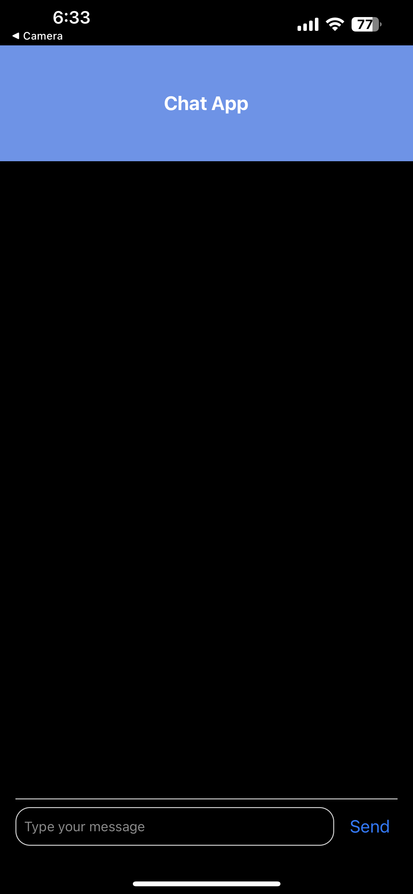
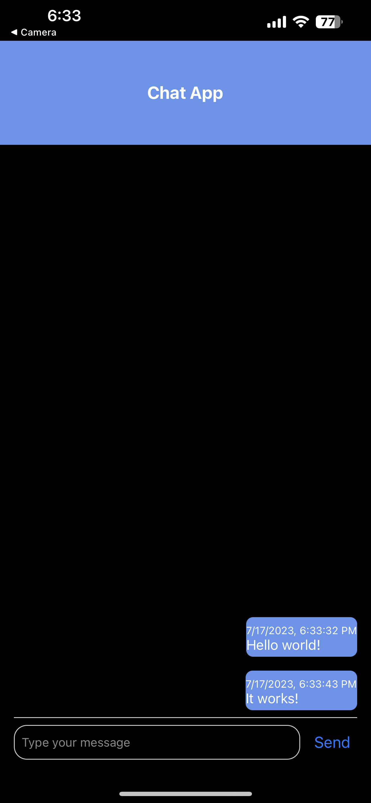
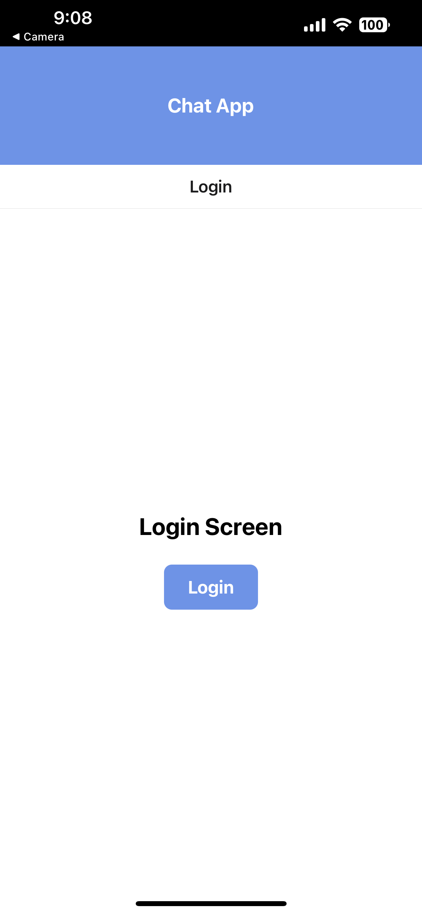
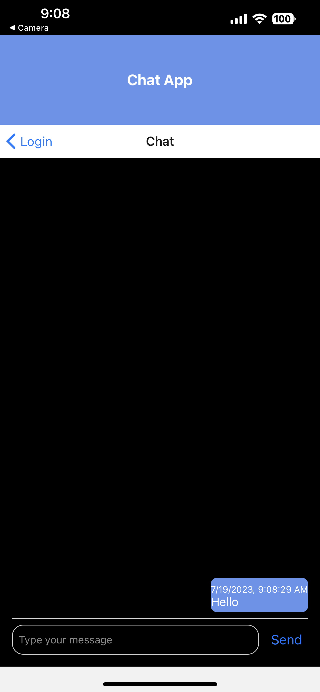

# LAB - Class 43/44

## Project: React Native Application - Chat App

## Author: Kaeden O'Meara

## Problem Domain

- **Phase 1** main focus is funcionality and proof of life.

- As a user I would like to be able to see my messages as I type them into the text box.
- As a user I would like to be able to chat with another user. (backend implementation soon)

- **Phase 2** Adding login screen before the chatScreen.

- As a user I would like to see a login screen
- As a user I would like to be able to go back to the login screen.

## Links and Resources

## Collaborators

ChatGPT

Ethan Storm

## Setup

- `npx create-expo-app`
- `npm i @expo/ngrok@^4.1.0`
- `npx expo start --tunnel`
- scan QR code

## Sandbox

[Sandbox 43](https://codesandbox.io/p/github/KaedenOC/-js-401d53-class-43/main?layout=%257B%2522sidebarPanel%2522%253A%2522EXPLORER%2522%252C%2522rootPanelGroup%2522%253A%257B%2522direction%2522%253A%2522horizontal%2522%252C%2522contentType%2522%253A%2522UNKNOWN%2522%252C%2522type%2522%253A%2522PANEL_GROUP%2522%252C%2522id%2522%253A%2522ROOT_LAYOUT%2522%252C%2522panels%2522%253A%255B%257B%2522type%2522%253A%2522PANEL_GROUP%2522%252C%2522contentType%2522%253A%2522UNKNOWN%2522%252C%2522direction%2522%253A%2522vertical%2522%252C%2522id%2522%253A%2522clk7mpian000g356peaxztvmp%2522%252C%2522sizes%2522%253A%255B70%252C30%255D%252C%2522panels%2522%253A%255B%257B%2522type%2522%253A%2522PANEL_GROUP%2522%252C%2522contentType%2522%253A%2522EDITOR%2522%252C%2522direction%2522%253A%2522horizontal%2522%252C%2522id%2522%253A%2522EDITOR%2522%252C%2522panels%2522%253A%255B%257B%2522type%2522%253A%2522PANEL%2522%252C%2522contentType%2522%253A%2522EDITOR%2522%252C%2522id%2522%253A%2522clk7mpian000b356pzkmhzpyi%2522%257D%255D%252C%2522sizes%2522%253A%255B100%255D%257D%252C%257B%2522type%2522%253A%2522PANEL_GROUP%2522%252C%2522contentType%2522%253A%2522SHELLS%2522%252C%2522direction%2522%253A%2522horizontal%2522%252C%2522id%2522%253A%2522SHELLS%2522%252C%2522panels%2522%253A%255B%257B%2522type%2522%253A%2522PANEL%2522%252C%2522contentType%2522%253A%2522SHELLS%2522%252C%2522id%2522%253A%2522clk7mpian000f356pd89aqh1q%2522%257D%255D%252C%2522sizes%2522%253A%255B100%255D%257D%255D%257D%252C%257B%2522type%2522%253A%2522PANEL_GROUP%2522%252C%2522contentType%2522%253A%2522DEVTOOLS%2522%252C%2522direction%2522%253A%2522vertical%2522%252C%2522id%2522%253A%2522DEVTOOLS%2522%252C%2522panels%2522%253A%255B%257B%2522type%2522%253A%2522PANEL%2522%252C%2522contentType%2522%253A%2522DEVTOOLS%2522%252C%2522id%2522%253A%2522clk7mpian000d356ptewgode2%2522%257D%255D%252C%2522sizes%2522%253A%255B100%255D%257D%255D%252C%2522sizes%2522%253A%255B50%252C50%255D%257D%252C%2522tabbedPanels%2522%253A%257B%2522clk7mpian000b356pzkmhzpyi%2522%253A%257B%2522tabs%2522%253A%255B%257B%2522id%2522%253A%2522clk7mpian000a356p4e5yn184%2522%252C%2522mode%2522%253A%2522permanent%2522%252C%2522type%2522%253A%2522FILE%2522%252C%2522filepath%2522%253A%2522%252FREADME.md%2522%257D%255D%252C%2522id%2522%253A%2522clk7mpian000b356pzkmhzpyi%2522%252C%2522activeTabId%2522%253A%2522clk7mpian000a356p4e5yn184%2522%257D%252C%2522clk7mpian000d356ptewgode2%2522%253A%257B%2522id%2522%253A%2522clk7mpian000d356ptewgode2%2522%252C%2522tabs%2522%253A%255B%255D%257D%252C%2522clk7mpian000f356pd89aqh1q%2522%253A%257B%2522id%2522%253A%2522clk7mpian000f356pd89aqh1q%2522%252C%2522activeTabId%2522%253A%2522clk7mq31600s2356p5x0jn5jg%2522%252C%2522tabs%2522%253A%255B%257B%2522id%2522%253A%2522clk7mpian000e356po8jq8ltv%2522%252C%2522mode%2522%253A%2522permanent%2522%252C%2522type%2522%253A%2522TERMINAL%2522%252C%2522shellId%2522%253A%2522clk7mpigs000kh2fmadwad9fd%2522%257D%252C%257B%2522type%2522%253A%2522TASK_LOG%2522%252C%2522taskId%2522%253A%2522start%2522%252C%2522id%2522%253A%2522clk7mq31600s2356p5x0jn5jg%2522%252C%2522mode%2522%253A%2522permanent%2522%257D%255D%257D%257D%252C%2522showDevtools%2522%253Atrue%252C%2522showShells%2522%253Atrue%252C%2522showSidebar%2522%253Atrue%252C%2522sidebarPanelSize%2522%253A15%257D)

## Screenshots

- Phase 1:

- Phase 2:

